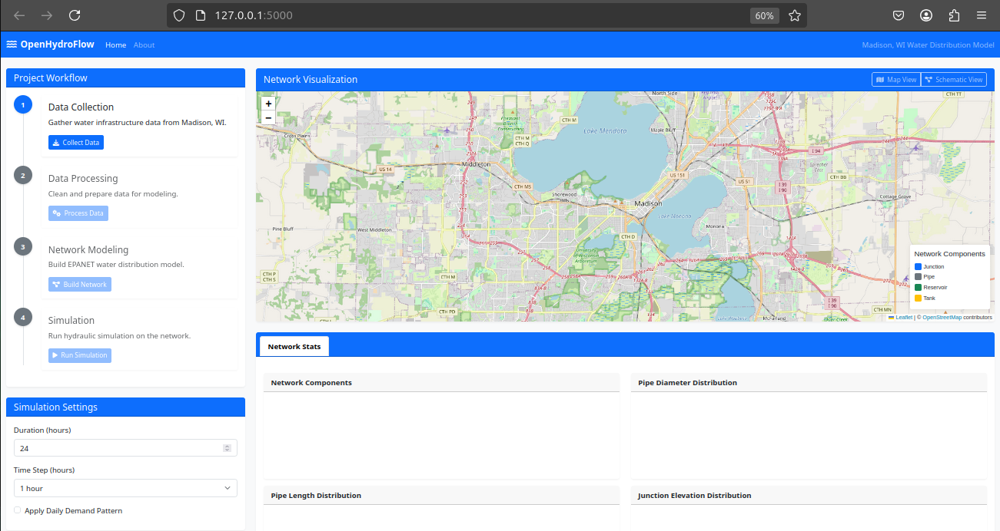

# HydroFlow - Water Distribution Modeling Application

HydroFlow is a web-based application for modeling and visualizing water distribution networks using EPANET hydraulic concepts. The application provides a comprehensive solution for creating, analyzing, and visualizing water distribution systems with an intuitive user interface.



## Features

- **Automated Data Collection**: Gather water infrastructure data from open-source APIs
- **GIS Integration**: Work with real-world geospatial data from the Madison, WI water system
- **Hydraulic Modeling**: Run extended-period hydraulic simulations
- **Interactive Visualization**: Visualize network components and simulation results
- **Time Series Analysis**: Analyze pressure, flow, and velocity over time
- **Scenario Management**: Create and compare different modeling scenarios

## Technology Stack

### Backend

- Python 3.12+
- Flask
- NetworkX (for network graph modeling)
- GeoPandas
- NumPy/Pandas
- EPANET command-line tool (optional, auto-downloaded)

### Frontend

- HTML5/CSS3
- JavaScript
- Bootstrap 5
- Leaflet.js
- Chart.js

## Project Structure

```
hydroflow/
│
├── app.py                     # Flask application entry point
├── setup.sh                   # Setup script for Linux/Mac
├── setup.bat                  # Setup script for Windows
├── requirements.txt           # Python dependencies
├── README.md                  # Project documentation
│
├── data/                      # Data storage
│   ├── raw/                   # Raw data files
│   ├── processed/             # Processed data files
│   └── output/                # Model outputs and visualizations
│
├── src/                       # Source code
│   ├── __init__.py
│   ├── data_collection.py     # Data collection from APIs
│   ├── data_processing.py     # Data cleaning and preparation
│   ├── network_model.py       # Network modeling
│   ├── simulation.py          # Hydraulic simulation
│   ├── visualization.py       # Results visualization
│   └── epanet_util.py         # EPANET utility functions
│
├── static/                    # Frontend static assets
│   ├── css/
│   │   └── style.css          # Custom CSS styles
│   └── js/
│       ├── main.js            # Main application logic
│       ├── api.js             # API client
│       ├── map.js             # Map management
│       └── charts.js          # Chart management
│
├── templates/                 # HTML templates
│   ├── index.html             # Main application page
│   └── about.html             # About page
│
└── epanet/                    # EPANET command-line tool (auto-downloaded)
```

## Getting Started

### Prerequisites

- Python 3.12 or higher
- pip (Python package manager)
- Git

### Installation

#### Automatic Setup (Recommended)

1. Clone the repository:

   ```
   git clone https://github.com/yourusername/hydroflow.git
   cd hydroflow
   ```

2. Run the setup script:

   On Linux/Mac:

   ```
   chmod +x setup.sh
   ./setup.sh
   ```

   On Windows:

   ```
   setup.bat
   ```

3. The script will:
   - Create a virtual environment
   - Install all dependencies
   - Set up data directories
   - Create a .env file for API keys

#### Manual Setup

1. Clone the repository:

   ```
   git clone https://github.com/yourusername/hydroflow.git
   cd hydroflow
   ```

2. Create a virtual environment and activate it:

   ```
   python -m venv venv
   source venv/bin/activate  # On Windows: venv\Scripts\activate
   ```

3. Install dependencies:

   ```
   pip install -r requirements.txt
   ```

4. Create necessary directories:

   ```
   mkdir -p data/raw data/processed data/output
   ```

5. Create a .env file with API keys:
   ```
   cp .env.sample .env
   ```

### Running the Application

1. Activate the virtual environment (if not already activated):

   ```
   source venv/bin/activate  # On Windows: venv\Scripts\activate
   ```

2. Start the Flask development server:

   ```
   python app.py
   ```

3. Open a web browser and navigate to:
   ```
   http://localhost:5000
   ```

## Data Sources

HydroFlow uses the following open data sources:

- City of Madison, WI Open Data Portal
- USGS National Water Information System
- EPA SDWIS (Safe Drinking Water Information System)
- USGS National Map API (for elevation data)

## Hydraulic Modeling

HydroFlow provides two methods for hydraulic simulation:

1. **EPANET Command-line Tool**: The application automatically downloads and configures the EPANET command-line tool for accurate hydraulic simulations.

2. **Built-in Simulator**: A simplified hydraulic calculator is included as a fallback when the EPANET command-line tool is not available.

## Workflow

HydroFlow follows a four-step workflow:

1. **Data Collection**: Gather water infrastructure GIS data, elevation data, water quality data, and monitoring station data from various APIs.
2. **Data Processing**: Clean and transform the collected data into a format suitable for hydraulic modeling.
3. **Network Modeling**: Create a water distribution model with pipes, junctions, reservoirs, and tanks.
4. **Simulation**: Run hydraulic simulations to calculate pressure, flow, velocity, and other parameters throughout the network over time.

## Contributing

Contributions are welcome! Please feel free to submit a Pull Request.

1. Fork the repository
2. Create your feature branch (`git checkout -b feature/amazing-feature`)
3. Commit your changes (`git commit -m 'Add some amazing feature'`)
4. Push to the branch (`git push origin feature/amazing-feature`)
5. Open a Pull Request

## License

This project is licensed under the MIT License - see the LICENSE file for details.

## Acknowledgments

- EPANET developers for the hydraulic modeling engine
- City of Madison, WI for providing open access to water infrastructure data
- USGS and EPA for their open data APIs
